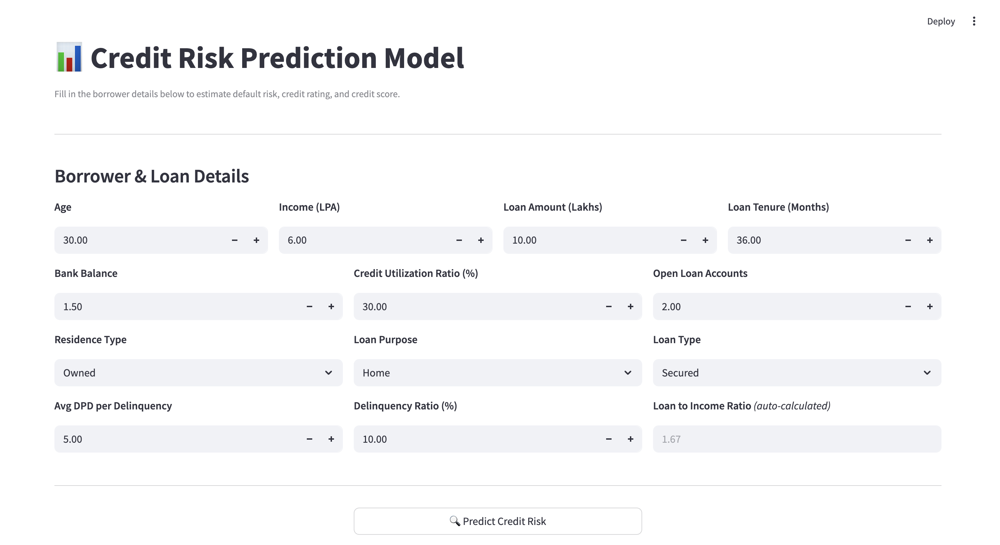
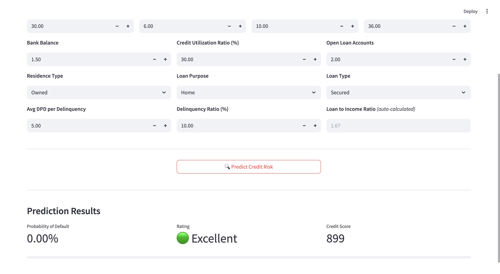

# 🏦 Credit Risk Prediction using Machine Learning

A machine learning application that predicts the **probability of loan default**, **credit score**, and **credit rating** for a loan applicant based on financial, demographic, and credit history information.

The project includes a complete ML pipeline from data preprocessing and model training to a **Streamlit web application** for real-time predictions.

---

## 📌 Project Overview

Financial institutions assess an applicant's creditworthiness before approving a loan. This project uses Machine Learning to estimate the likelihood of default and generate an interpretable credit score.

The application predicts:

- 📊 Probability of Default (PD)
- ⭐ Credit Score (300–900)
- 🏅 Credit Rating (Poor, Average, Good, Excellent)

---

## 🚀 Features

- Data preprocessing pipeline
- Feature engineering
- Missing value handling
- One-Hot Encoding
- Feature Scaling
- Class imbalance handling using **SMOTE-Tomek**
- Logistic Regression model
- Hyperparameter tuning using **Optuna**
- Streamlit Web Application
- Interactive user interface
- Model serialization using Joblib

---

## 📂 Project Structure

```text
Credit-Risk-Prediction/
│
├── Artifacts/
│   ├── model_data.joblib
│   └── ...
│
├── app/
│   ├── main.py
│   ├── prediction_helper.py
│   └── ...
│
├── notebooks/
│   └── Credit_Risk_Prediction.ipynb
|
├── images/
│   └── Homepage.png
│   └── Result.png
├── requirements.txt
├── README.md
└── .gitignore
```

---

## 📊 Input Features

| Feature | Description |
|----------|-------------|
| Age | Applicant age |
| Income (LPA) | Annual income in Lakhs |
| Loan Amount | Requested loan amount |
| Loan Tenure | Loan tenure in months |
| Bank Balance | Current bank balance |
| Credit Utilization Ratio | Percentage of utilized credit |
| Open Loan Accounts | Number of active loan accounts |
| Residence Type | Owned / Mortgage / Rented |
| Loan Purpose | Home / Personal / Education / Auto |
| Loan Type | Secured / Unsecured |
| Loan-to-Income Ratio | Loan amount relative to annual income |
| Delinquency Ratio | Ratio of missed payments |
| Average DPD | Average Days Past Due |

---

## 🎯 Model Output

The application predicts:

- **Probability of Default (%)**
- **Credit Score (300–900)**
- **Credit Rating**

| Credit Score | Rating |
|--------------|---------|
| < 500 | Poor |
| 500–649 | Average |
| 650–749 | Good |
| ≥ 750 | Excellent |

---

## 🛠️ Machine Learning Pipeline

1. Data Cleaning
2. Exploratory Data Analysis
3. Feature Engineering
4. One-Hot Encoding
5. Feature Scaling
6. Handling Class Imbalance (SMOTE-Tomek)
7. Model Training
8. Hyperparameter Optimization (Optuna)
9. Model Evaluation
10. Deployment using Streamlit

---

## 📈 Model Performance

### Logistic Regression

| Metric | Score |
|--------|------:|
| Accuracy | 93% |
| Recall | 94% |
| Precision | 55% |
| F1 Score | 70% |

The model was optimized to prioritize **high recall**, ensuring that potential loan defaulters are correctly identified.

---

## 💻 Technologies Used

- Python
- Pandas
- NumPy
- Scikit-learn
- Imbalanced-learn
- Optuna
- Matplotlib
- Seaborn
- Streamlit
- Joblib

---

## ⚙️ Installation

Clone the repository

```bash
git clone https://github.com/<your-username>/Credit-Risk-Prediction.git
```

Navigate to the project directory

```bash
cd Credit-Risk-Prediction
```

Install dependencies

```bash
pip install -r requirements.txt
```

Run the application

```bash
streamlit run app/main.py
```
---
## Application Preview




___
## 📌 Future Improvements

- XGBoost and LightGBM comparison
- Explainable AI using SHAP
- Model monitoring dashboard
- Cloud deployment
- REST API using FastAPI
- Docker support

---

## 👨‍💻 Author

**Lyneshia Correa**

- GitHub: https://github.com/lyneshia
- LinkedIn: https://www.linkedin.com/in/lyneshia-correa-777b8720b

---

## ⭐ If you found this project useful, consider giving it a star!
